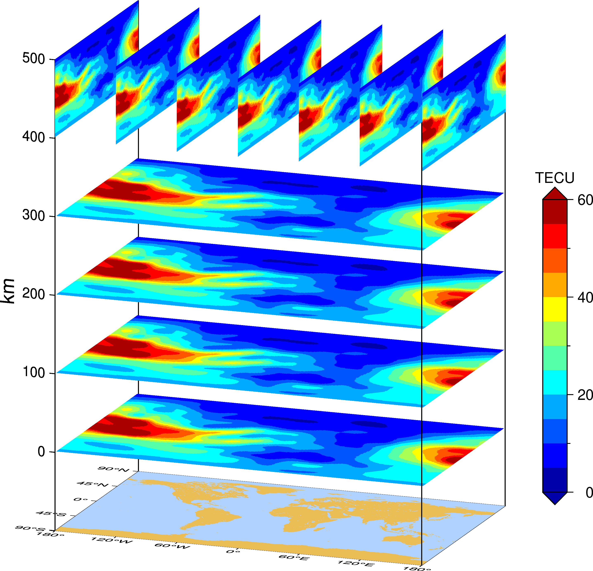

# 科研绘图

## 001.晨昏线

```bash
gmt begin
gmt figure ex01 png E+600
gmt coast -Rd -JX15c/8c -Bxa60g60 -Bya30g30 -W0.5p -A5000 -S175/210/255 --MAP_FRAME_TYPE=plain
REM 绘制晨昏线
gmt solar -Td+d2016-02-09T16:00:00 -Gnavy@80 
REM 计算指定时间太阳位置并绘制在底图上
gmt solar -I+d2016-02-09T16:00:00 -C | gmt plot -Sk@sunglasses/1.5c -Gyellow -W0.2p
gmt end
```


## 002.多图绘制

```bash
gmt begin
gmt set FONT 10p,0
gmt set MAP_FRAME_TYPE plain
gmt set MAP_FRAME_PEN 0.5p
gmt set MAP_TICK_LENGTH_PRIMARY 0p/0p
gmt figure ex02 png E+600
gmt subplot begin 3x4 -Fs4c/2.4c -M0.5c -SCb -SRl  -R-180/180/-90/90 -JX4c/2.4c  -Xr20c
    gmt makecpt -Cno_green -T0/2/0.2 -D -H >1.cpt
    
    gmt subplot set 0,0 
    gmt basemap -JX4c/2.4c -R-180/180/-90/90  -Bya45 -BWsen
    gmt grdimage ex_2008.nc -C1.cpt -E1000 
    gmt coast  -R-180/180/-90/90 -JX4c/2.4c -Blrtb -A10000 -W0.5p
    gmt colorbar -C1.cpt -Bxa0.4+l"TEC" -By -DJMR+h+w4/0.2+e+o11c/-7c
    echo 0 103  2008| gmt text -F+f10p -N

    gmt subplot set 0,1
    gmt basemap -JX4c/2.4c -R-180/180/-90/90 -Bwsen
    gmt grdimage ex_2008.nc -C1.cpt -E1000 
    gmt coast  -R-180/180/-90/90 -JX4c/2.4c  -Blrtb -A10000 -W0.5p
    echo 0 103  2009| gmt text -F+f10p -N

    gmt subplot set 0,2
    gmt basemap -JX4c/2.4c -R-180/180/-90/90  -Bwsen
    gmt grdimage ex_2008.nc -C1.cpt -E1000 
    gmt coast  -R-180/180/-90/90 -JX4c/2.4c  -Blrtb -A10000 -W0.5p
    echo 0 103  2010| gmt text -F+f10p -N
    
    gmt subplot set 0,3
    gmt basemap -JX4c/2.4c -R-180/180/-90/90 -Bwsen
    gmt grdimage ex_2008.nc -C1.cpt -E1000 
    gmt coast  -R-180/180/-90/90 -JX4c/2.4c  -Blrtb -A10000 -W0.5p
    echo 0 103  2011| gmt text -F+f10p -N

    gmt subplot set 1,0
    gmt basemap -JX4c/2.4c -R-180/180/-90/90 -Bya45+l"Geographic Latitude (\260)" -BWsen
    gmt grdimage ex_2008.nc -C1.cpt -E1000 
    gmt coast  -R-180/180/-90/90 -JX4c/2.4c  -Blrtb -A10000 -W0.5p
    echo 0 103  2012| gmt text -F+f10p -N

    gmt subplot set 1,1
    gmt basemap -JX4c/2.4c -R-180/180/-90/90 -Bwsen
    gmt grdimage ex_2008.nc -C1.cpt -E1000 
    gmt coast  -R-180/180/-90/90 -JX4c/2.4c -Blrtb -A10000 -W0.5p
    echo 0 103  2013| gmt text -F+f10p -N

    gmt subplot set 1,2
    gmt basemap -JX4c/2.4c -R-180/180/-90/90 -Bwsen
    gmt grdimage ex_2008.nc -C1.cpt -E1000 
    gmt coast  -R-180/180/-90/90 -JX4c/2.4c -Blrtb -A10000 -W0.5p
    echo 0 103  2014| gmt text -F+f10p -N

    gmt subplot set 1,3
    gmt basemap -JX4c/2.4c -R-180/180/-90/90 -Bxa90+l"Longitude(\260)" -Bya0 -BwSen
    gmt grdimage ex_2008.nc -C1.cpt -E1000 
    gmt coast  -R-180/180/-90/90 -JX4c/2.4c -Blrtb  -A10000 -W0.5p
    echo 0 103  2015| gmt text -F+f10p -N

    gmt subplot set 2,0
    gmt basemap -JX4c/2.4c -R-180/180/-90/90 -Bxa90+l"Longitude(\260)" -Bya45 -BWSen
    gmt grdimage ex_2008.nc -C1.cpt -E1000 
    gmt coast  -R-180/180/-90/90 -JX4c/2.4c -Blrtb  -A10000 -W0.5p
    echo 0 103  2016| gmt text -F+f10p -N

    gmt subplot set 2,1
    gmt basemap -JX4c/2.4c -R-180/180/-90/90 -Bxa90+l"Longitude(\260)" -Bya0 -BwSen 
    gmt grdimage ex_2008.nc -C1.cpt -E1000 
    gmt coast  -R-180/180/-90/90 -JX4c/2.4c -Blrtb -A10000 -W0.5p
    echo 0 103  2017| gmt text -F+f10p -N

    gmt subplot set 2,2
    gmt basemap -JX4c/2.4c -R-180/180/-90/90 -Bxa90+l"Longitude(\260)" -Bya0 -BwSen
    gmt grdimage ex_2008.nc -C1.cpt -E1000  
    gmt coast  -R-180/180/-90/90 -JX4c/2.4c  -Blrtb -A10000 -W0.5p
    echo 0 103  2018| gmt text -F+f10p -N
	
gmt subplot end
gmt end 
```


## 003.中国国界

```bash
gmt begin ex01 png
gmt coast -JD105/35/36/42/10c -R70/140/0/60 -Glightbrown -Slightblue -Ba10f5g10 -Lg130/8+c11+w900k+f+u
gmt plot CN-border-La.gmt -W0.1p
gmt end
```


## 004.图中图

```bash
gmt begin
gmt set FONT 15p,0
gmt set MAP_FRAME_TYPE plain
gmt figure ex01 png E+600

REM 绘制底图
gmt basemap -JX15c/8c -R-180/180/-90/90 -BWSrt
gmt coast  -R-180/180/-90/90 -JX15c/8c -Bxa90 -Bya30 -BWSen -W -A10000
REM 绘制小红框
gmt plot area1.txt -W1p,red
gmt plot area2.txt -W1p,red

REM 绘制子图
gmt inset begin -DjBR+w6.5c/4c+o0.1c -F+gwhite+p1p -M1c/0.8c
    gmt set FONT 10p,0
    gmt coast  -R-66/-54/-66/-60  -JX5c/3c  -Bxa6g6  -Bya4g4 -BWSen -W -A10000
    REM 绘制大红框
    gmt plot area1.txt -W1p,red
    echo -57.901  -63.321  ohi3 |gmt plot -Sc5p -W1p,black -Glightred
    echo -57.901  -63.321  ohi3 | gmt text -F+f15p,0 -D27p/0p
gmt inset end    

gmt inset begin -DjTL+w6.5c/4c+o0.1c -F+gwhite+p1p -M1.2c/0.6c
    gmt set FONT 10p,0
    gmt coast  -R135/149/40/52  -JX5c/3c  -Bxa6  -Bya4 -BWSen -W -A10000
    gmt plot area2.txt -W1p,red
    echo 142.717  47.030  yssk |gmt plot -Sc5p -W1p,black -Glightred
    echo 142.717  47.030  yssk | gmt text -F+f15p,0 -D25p/0p
gmt inset end   

REM 绘制箭头
echo -57.901  -63.321 9 6.2 | gmt plot  -Sv0.5c+e -W1p -Gred
echo 142.717  47.030 180 8 | gmt plot  -Sv0.5c+e -W1p -Gred

gmt end 
pause
```


## 005.三维切片图

```bash
gmt begin
gmt set MAP_FRAME_TYPE plain 
gmt set MAP_FRAME_PEN 0.5p,black
gmt figure ex01 png E+600
gmt makecpt -Cjet -T0/60/5 -D

REM 平面图
gmt grdview 00.nc -JX8c/5c -JZ10c -R-180/180/-90/90/-100/500 -Bz100+l"km"  -I -Wm1p,white -p160/15/-100
gmt coast -Bxa60+l"Lat(\260)" -Bya45+l"Lon(\260)" -Bz100+l"km"  -BWSrtu4 -S175/210/255 -Glightbrown -p160/15/-100
gmt grdimage 00.nc -E100 -C -p160/15/0
gmt grdimage 00.nc -E100 -C -p160/15/100
gmt grdimage 00.nc -E100 -C -p160/15/200
gmt grdimage 00.nc -E100 -C -p160/15/300
gmt colorbar -C -Bx -By+l"TECU" -DJMR+v+w6/0.5+e+o2c/2c
REM 绘制竖线
gmt coast -Bxa60+l"Lat(\260)" -Bya45+l"Lon(\260)" -Bz100+l"km"  -BWSrtZ1 -S175/210/255 -Glightbrown -p160/15/-100
gmt coast -Bxa60+l"Lat(\260)" -Bya45+l"Lon(\260)" -Bz100+l"km"  -BWSrtu23 -S175/210/255 -Glightbrown -p160/15/-100
REM 切片图
gmt grdimage 00.nc -E100 -C  -JX5c/1.7c  -px160/15/500 -Xa-9.4c -Ya9.2c 
gmt grdimage 00.nc -E100 -C  -JX5c/1.7c  -px160/15/500 -Xa-8.15c -Ya9.05c
gmt grdimage 00.nc -E100 -C  -JX5c/1.7c -px160/15/500 -Xa-6.9c -Ya8.9c
gmt grdimage 00.nc -E100 -C  -JX5c/1.7c  -px160/15/500 -Xa-5.65c -Ya8.8c
gmt grdimage 00.nc -E100 -C  -JX5c/1.7c  -px160/15/500 -Xa-4.4c -Ya8.7c
gmt grdimage 00.nc -E100 -C  -JX5c/1.7c  -px160/15/500 -Xa-3.15c -Ya8.6c
gmt grdimage 00.nc -E100 -C  -JX5c/1.7c  -px160/15/500 -Xa-1.87c -Ya8.5c
gmt end
```


